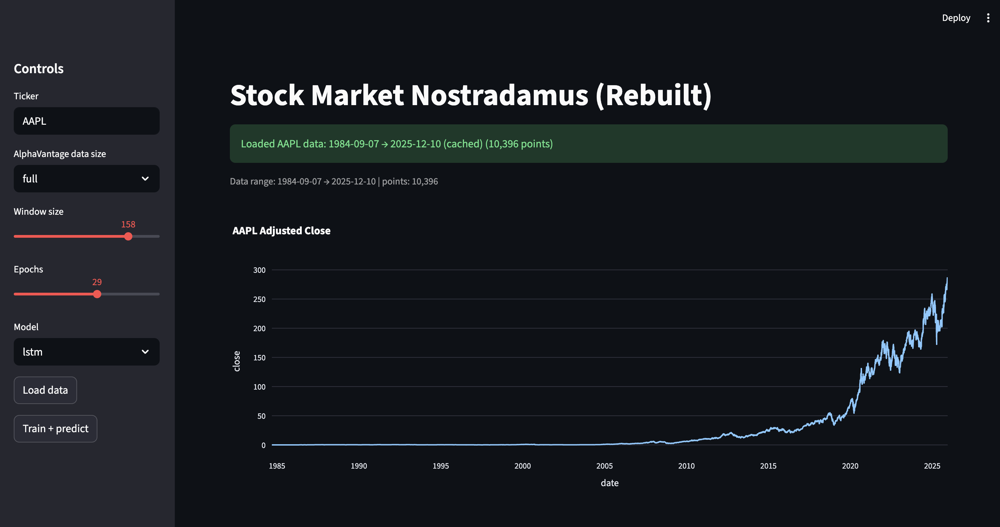
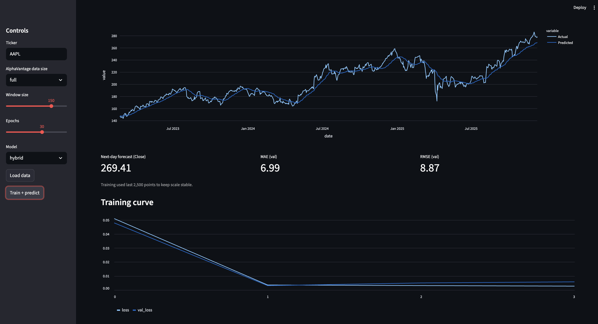
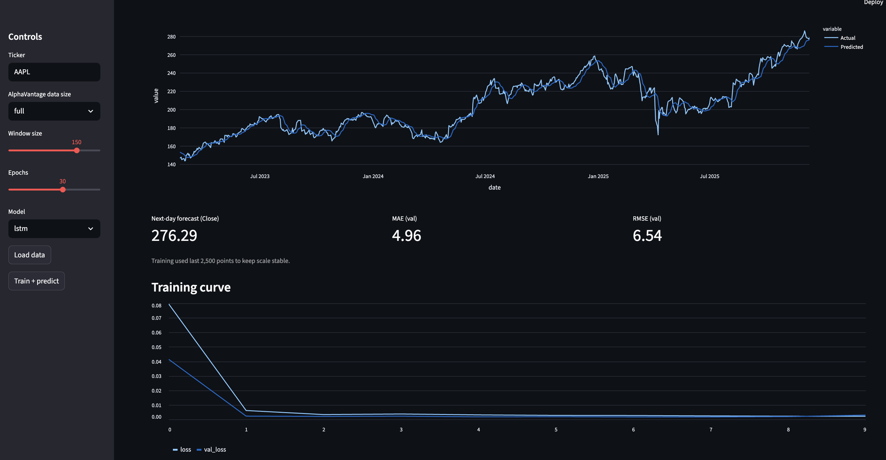

# 📈 Stock Market Nostradamus (Rebuilt)

Interactive Streamlit app that:
- pulls historical stock prices,
- trains an LSTM / hybrid model,
- shows validation-window predictions,
- and visualizes the training curve (loss vs val_loss).

> ⚠️ For learning & demo only — not financial advice.

---

## 🔍 What this app does

- **Data loading**
  - Uses AlphaVantage or cached/Stooq data (see `src/data.py`)
  - Lets you pick:
    - Ticker (e.g. `AAPL`)
    - Data size: `compact` / `full`

- **Modeling**
  - Choose **LSTM** or **Hybrid** model (`src/train_tf.py`)
  - Control:
    - Window size
    - Epochs
  - Trains on the **last ~2,500 points** to keep scale stable

- **Visuals**
  - AAPL Close price history
  - **Actual vs Predicted** (validation window only)
  - Metrics: **MAE**, **RMSE**, next-day forecast
  - **Training curve:** train loss vs val loss
  - Saves `last_run_predictions.csv` for analysis

---

## 🖼 Screenshots

### Load & explore data


### Hybrid model


### LSTM model


---

## 🛠 Tech stack

- Python
- Streamlit
- TensorFlow / Keras
- Pandas, NumPy
- Plotly Express

---

## 🚀 Run locally

```bash
# Clone repo
git clone https://github.com/YOUR_USERNAME/stock_nostradamus.git
cd stock_nostradamus

# Setup environment
python3 -m venv .venv
source .venv/bin/activate

# Install deps
pip install -r requirements.txt

# Optional: AlphaVantage key
export ALPHAVANTAGE_API_KEY="YOUR_KEY_HERE"

# Run app
streamlit run app.py

